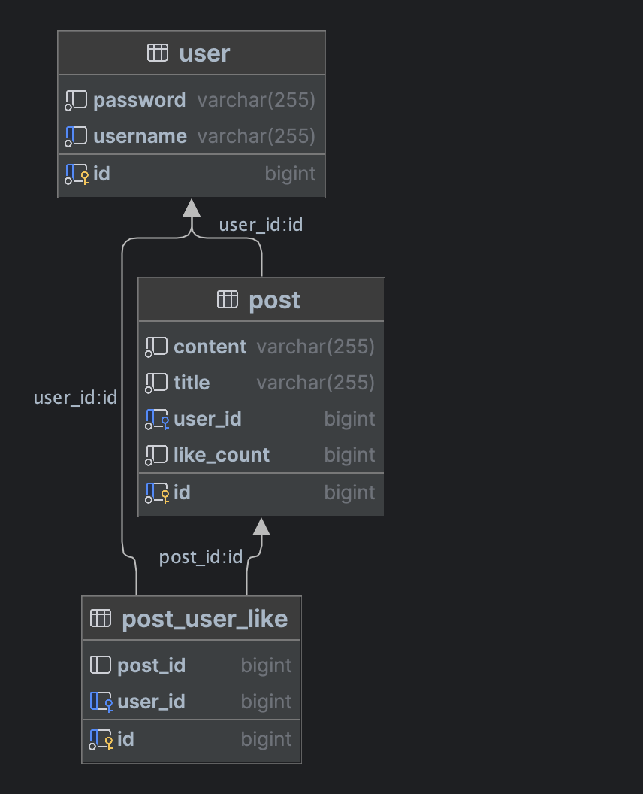

# 관계형 데이터 최적 방법으로 조회하기

## Entity && DB 설계

1. 유저 엔티티 생성
    * 유저 ID(primary key), 이름, 비밀번호 컬럼 생성
    * 좋아요 엔티티와의 연관 관계 설정
2. 글 엔티티 생성
    * 글 ID(primary key), 제목, 내용, 작성자(외래 키), 좋아요 개수 컬럼 생성
    * 유저(작성자), 좋아요 엔티티와의 연관 관계 설정
3. 좋아요 엔티티 생성
    * 좋아요 ID(primary key), 글(외래 키), 사용자(외래 키) 컬럼 생성
    * 글 엔티티와 유저 엔티티와의 연관 관계 설정

### DB ERD



## API

[소스 코드](api)

* GET /posts/{id}
    * 일반적인 조회 방식입니다.
* GET /posts-cache/{id}
    * 캐시를 사용한 조회 방식입니다.(TTL: 5s)

Request Param으로는 useColumn(default: false)가 있습니다.

true로 설정하면, 글 엔티티의 좋아요 개수를 조회할 때, 좋아요 엔티티를 조회하지 않고, 좋아요 개수 컬럼을 조회합니다.

반대로 false로 설정하거나 명시하지 않았다면, 좋아요 개수 컬럼을 조회하지 않고, 좋아요 엔티티를 카운트 쿼리를 이용하여 조회합니다.

## 부하 테스트

* 글과 유저 테이블에는 각각 1000개, 좋아요 테이블에는 200000개의 데이터를 임의로 존재함.
* 1번 글에 연관된 좋아요 데이터는 100000개
* 테스트 도구로는 [k6](https://github.com/grafana/k6)를 사용
* 테스트 방식은 60초 동안 100명의 사용자가 1번 글을 조회

### 일반적인 방식(카운트 쿼리와 인덱스)

스프링 JPA에서 엔티티에서 외래키는 자동으로 인덱스를 생성합니다. 따로 나눠서 테스트 하지는 않았습니다.


```bash
curl -X GET "http://localhost:8080/posts/1"
```


**TPS = 246/s**

### 좋아요 개수 컬럼을 조회하는 방식

```bash
curl -X GET "http://localhost:8080/posts/1?useColumn=true"
```


**TPS = 5899/s**

### 캐시를 사용하는 방식

```bash
curl -X GET "http://localhost:8080/posts-cache/1"
```


**TPS = 23715/s**

## 정리

카운트 쿼리 < 카운트 컬럼 < 캐시 순으로 성능이 좋습니다.

1. 카운트 쿼리 장단점
    * 장점 - 정확한 데이터를 조회할 수 있음
    * 단점 - 성능이 좋지 않음
2. 카운트 컬럼 장단점
    * 장점 - 추가적인 쿼리가 필요하지 않아 1번보다 빠름
    * 단점 - 동시성 이슈가 발생할 수 있음(실제 좋아요 개수가 일치하지 않을 수 있음)
3. 캐시 장단점
    * 장점 - 캐시가 있다면 DB에 접근할 필요가 없어 성능이 매우 좋음
    * 단점 - 만약 TTL이 설정되어있다면 그 시간 동안 최신 값을 볼 수 없다, 다른 서버도 캐시를 사용해야한다면?